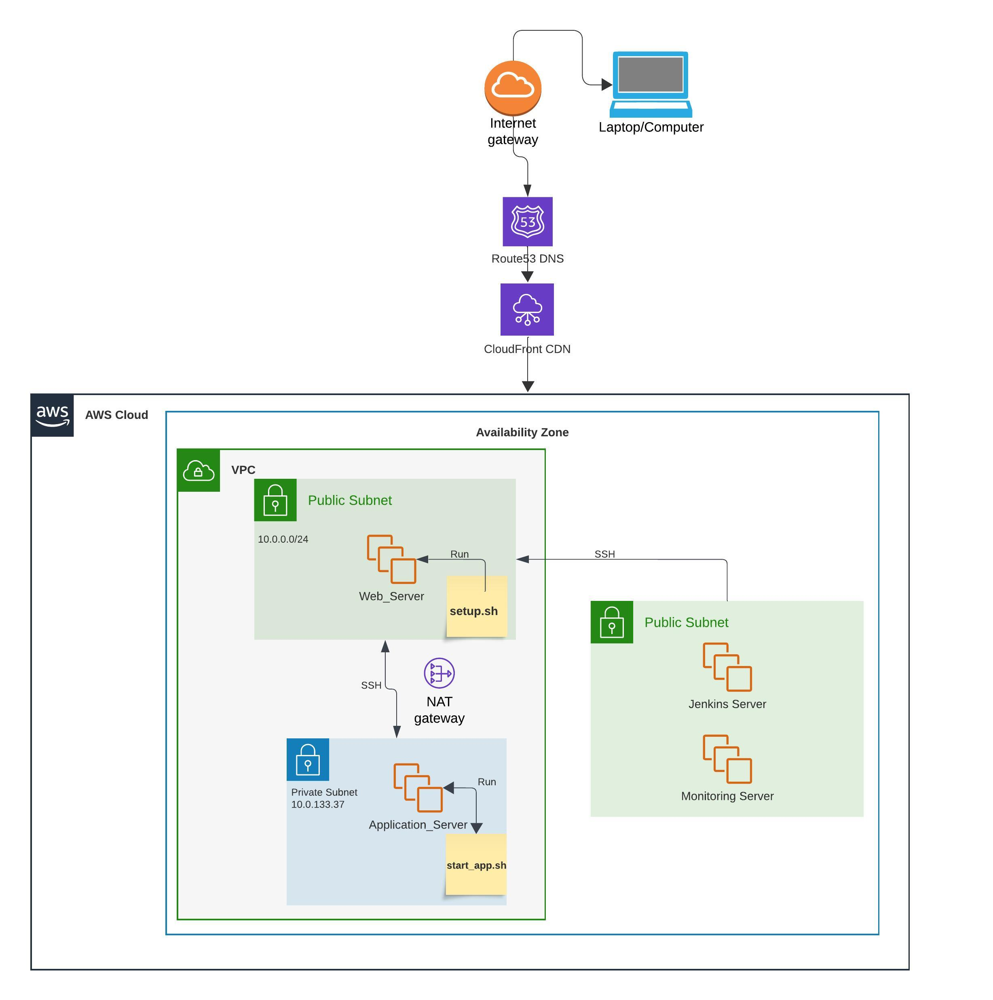

# Microblog VPC Deployment

## PURPOSE

The purpose of this workload is to set up a multi-tier application architecture using AWS services. This project involves creating a VPC with public and private subnets, deploying EC2 instances for different purposes ('Jenkins', 'Web_Server', and 'Application_Server'), and implementing a CI/CD pipeline using Jenkins. The goal is to create a secure and scalable infrastructure for deploying and managing a web application.

## STEPS TAKEN:

1. **VPC Creation**: 
   - Created a VPC named '"my-vpc"' with CIDR 10.0.0.0/16
   - Set up two subnets:
     - Public subnet (CIDR: 10.0.0.0/20)
     - Private subnet (CIDR: 10.0.128.0/20)
   - Enabled DNS resolution and hostnames
   - Created a NAT gateway in the same availability zone

   *Why*: This step establishes a secure and isolated network environment for our application.

2. **EC2 Instance Creation**:
   - 'Jenkins' Server (t3.medium)
   - 'Web_Server' (t3.micro) in the public subnet
   - 'Application_Server' (t3.micro) in the private subnet

   *Why*: These instances serve different purposes in our architecture - CI/CD, web serving, and application hosting.

3. **Jenkins Installation and Configuration**:
   - Updated the server: 'sudo apt update' 'sudo apt upgrade'
   - Installed Jenkins, and dependancies (Python, pip,) on the Jenkins Server
   - Set up SSH keys 'ssh-keygen' for secure communication between instances, places this key in the [/.ssh/authorized_keys] folder
   - Secured the file 'chmod 600 ~/.ssh/authorized_keys'
   - SSH into the 'Web_Server' to add Jenkins to the "Known Hosts" file for seamless connecting moving forward.

   *Why*: Jenkins is crucial for implementing our CI/CD pipeline.

*Question: What does it mean to be a known host?*
Known host means that the user has already confirmed that the host trying to connect is authentic. The host is added to a file so that the following connection this question will not be asked and the user can go right in.

4. **Web_Server Configuration**:
   - Installed and configured Nginx on the 'Web_Server'
   - Modified Nginx configuration to proxy requests to the 'Application_Server'
   - Created and setup 'setup.sh'. This script will download the script 'start_app.sh' from Github and run it on the 'Application_Server'.

   *Why*: Nginx acts as a reverse proxy, improving security and performance.

5. **Application_Server Setup**:
   - Created and configured the Application Server in the private subnet
   - Set up SSH access from the 'Web_Server'
   - Created 'start_app.sh'. This script will set up the server so that has all of the dependencies that the application needs, clone the GH repository, and install dependancies from the requirements.txt file.

   *Why*: This setup isolates our application logic from direct internet access.

6. **VPC Peering and Route Table Configuration**:
   - Created a VPC peering connection between the Default VPC and my-vpc
   - Updated route tables to allow communication between VPCs

   *Why*: This enables secure communication between our custom VPC and the default VPC.

7. **GitHub Integration and Jenkins Pipeline**:
   - Cloned the repository and set up GitHub access, added the github token to '~/.secrets/github_token' and secured it with 'chmod 600 ~/.secrests/github_token'
   - Updated the '.gitignore' file
   - Created a multibranch pipeline in Jenkins
   - Modified the Jenkinsfile for our deployment process

   *Why*: This step automates our deployment process and integrates with version control.

8. **Monitoring Setup**:
   - Created a "Monitoring" EC2 instance with Prometheus and Grafana

   *Why*: This provides valuable insights into the performance and health of our application.

## SYSTEM DESIGN DIAGRAM:

**Lucid Charts:**

** 

## ISSUES/TROUBLESHOOTING

1. **Security Group Configuration**: Initially had issues with the Application Server's security group. Resolved by correctly configuring inbound rules to point to the Web Server's security group instead of a specific IP.

2. **SSH Access**: Encountered difficulties in SSH access between instances. Resolved by carefully setting up and distributing SSH keys and ensuring proper permissions on key files.

3. **VPC Peering**: Initially overlooked the need for VPC peering, which caused communication issues between the Jenkins server and other instances. Resolved by setting up VPC peering and updating route tables.

4. **Jenkins Permissions**: Faced issues with Jenkins user permissions. Resolved by adding the Jenkins user to the sudoers file for seamless administration.

6. **Jenkins Build**: Ran into issues with the Jenkins build completing do to an issue with the Build as well as the Deploy stage of the Jenkins file.

## OPTIMIZATION

### Advantages of Separating Deployment and Production Environments

1. **Isolation**: Keeps development and testing separate from live production systems, reducing the risk of accidental changes affecting end-users.
2. **Security**: Allows for stricter security measures in the production environment.
3. **Scalability**: Enables independent scaling of development and production resources.
4. **Testing**: Facilitates thorough testing in a mirror of the production environment before actual deployment.

### Does this Infrastructure Address These Concerns?

Partially. The current setup provides some isolation by using different subnets and security groups. However, it could be more secure by adding better security groups.

### Is This a "Good System"?

The system incorporates many good practices like using a VPC, separating public and private subnets, and implementing a CI/CD pipeline, there's room for improvement with monitoring, automation and better security features.

### Optimization Suggestions

1. Create separate VPCs for development, and production environments.
2. Better monitoring and alerting system can be added.
3. Use a load balancer and/or auto scaling for the production environment to make sure the system can handle spikes.
4. Some kind of version control or way to roll back changes quickly
5. Enhance security by implementing a bastion host for secure SSH access to private instances.

## CONCLUSION

This project has successfully set up a basic multi-tier application infrastructure on AWS, including concepts like VPCs, subnets, scripting and CI/CD pipelines with Ubuntu Linux. While the current setup provides a functional environment for deployment and hosting, there are several areas where it could be optimized for better security, scalability, and separation of concerns.

